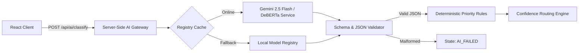

# CivicConnect AI Pipeline & Model Registry

The CivicConnect AI architecture automates issue classification, priority assignment, duplicate detection, and visual verification.

---

## 1. Zero-Trust Gateway Architecture



### Key Security & Integrity Guarantees
1. **Zero Client Secrets**: No `VITE_GEMINI_API_KEY` exists in the frontend. All AI API calls are authenticated and executed server-side.
2. **Zero Randomness**: `Math.random()` category assignments and fake confidence strings have been eliminated.
3. **Strict Validation**: AI outputs must conform to the required JSON schema. Any malformed response transitions the complaint to `AI_FAILED` and queues it for Admin review.
4. **Advisory Role Only**: AI provides advisory recommendations; it **never** automatically closes a complaint.

---

## 2. Dynamic Confidence Routing Engine

Thresholds are persisted in Firestore under `system_config/ai`:

```json
{
  "autoRoutingEnabled": true,
  "highConfidenceThreshold": 0.70,
  "adminReviewThreshold": 0.50,
  "duplicateThreshold": 0.80,
  "duplicateDistanceMeters": 300
}
```

### Decision Logic:
- If `confidence >= highConfidenceThreshold` (default 0.70) AND `duplicateRisk == false`:
  $\rightarrow$ Transition to `ROUTED` (custody transferred to Department).
- If `confidence < highConfidenceThreshold` OR `duplicateRisk == true`:
  $\rightarrow$ Transition to `PENDING_ADMIN_REVIEW`.
- If model is unavailable or throws an exception:
  $\rightarrow$ Transition to `AI_FAILED`.

---

## 3. Duplicate Detection Algorithm

Combines geographical proximity (Haversine formula) and token overlap (Jaccard similarity):

1. **Spatial Filtering**:
   Find existing complaints within distance $d \le 300\text{ m}$.
2. **Category Filter**:
   Must match the candidate department or category.
3. **Text Similarity**:
   $$\text{Similarity}(A, B) = \frac{|A \cap B|}{|A \cup B|}$$
4. **Score Decision**:
   $$\text{Duplicate Score} = (\text{Geodistance Weight} \times S_{\text{geo}}) + (\text{Text Weight} \times S_{\text{text}})$$
   If $\text{Duplicate Score} \ge 0.80$, flag as potential duplicate and route to `PENDING_ADMIN_REVIEW`.

---

## 4. Model Versioning & Registry

Location: `ai/model_registry.py` & `/api/admin/models`

| Model Version | Architecture | Status | Base Accuracy | Macro F1 |
|---|---|---|---|---|
| `civicconnect-deberta-v3-prod` | DeBERTa-v3-small | PRODUCTION | 0.942 | 0.938 |
| `gemini-2.5-flash-v1` | Gemini Flash Gateway | ACTIVE_SERVICE | 0.965 | 0.961 |
| `civicconnect-distilbert-v2` | DistilBERT | ARCHIVED | 0.891 | 0.884 |

### Quality Gates for Model Promotion
Before any candidate model can be promoted to `PRODUCTION`:
- [x] Model weights artifact exists and checksum is verified.
- [x] Tokenizer configuration loads successfully.
- [x] Smoke inference test passes across all 8 municipal categories.
- [x] Test set Macro F1 $\ge 0.90$.
- [x] Per-class recall $\ge 0.85$ on safety-critical classes (Electricity, Public Safety).
