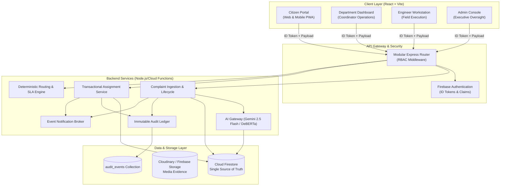

# CivicConnect Architecture & System Design

CivicConnect is an enterprise-grade, AI-powered smart public issue reporting and resolution platform. It connects citizens, municipal administration, department coordinators, and on-ground field engineers in an auditable, deterministic workflow.

---

## 1. High-Level System Architecture



---

## 2. Core Architectural Principles

1. **Firestore as Single Source of Truth**:
   - `localStorage` is strictly restricted to client UI preferences (theme, language, draft cache). No complaints, users, departments, statuses, or tokens are cached in browser storage.
   - All complaint queries, status transitions, and assignments are validated and persisted in Cloud Firestore.
2. **Zero Client Secrets**:
   - No AI API keys or Gemini credentials exist in client bundles. All intelligence operations run server-side via the AI Gateway (`/api/ai/classify`, `/api/ai/verify`).
3. **Deterministic State Transitions**:
   - Explicit 17-state finite state machine (`workflow.js`) enforced by server-side middleware and Firestore security rules.
4. **UID-Based Relational Integrity**:
   - Assignments reference Firebase UIDs (`assignedEngineerId`), eliminating string name collisions.
5. **Zero Mock Fallbacks**:
   - Production API failures propagate transparently as standard error payloads (`VALIDATION_ERROR`, `UNAUTHORIZED`, `FORBIDDEN`, `NOT_FOUND`, `INVALID_TRANSITION`, `AI_UNAVAILABLE`).
6. **Immutable Audit Ledger**:
   - Every status shift, assignment, evidence submission, and verification creates a permanent entry in `audit_events`.

---

## 3. Technology Stack

| Layer | Component | Technology |
|---|---|---|
| Frontend | Framework & Bundler | React 19, Vite 6 |
| Styling | Theme & Design | Tailwind CSS v4, Lucide Icons, Glassmorphism design |
| Auth & Security | Identity | Firebase Authentication (Email/Password, Google OAuth) |
| Database | Data Store | Cloud Firestore (Canonical schema with sub-objects) |
| Media Storage | Evidence Vault | Cloudinary Secure CDN / Firebase Cloud Storage |
| Backend API | Application Server | Node.js Express 5 / Firebase Cloud Functions |
| AI / ML Engine | Classifier & Vision | Gemini 2.5 Flash / DeBERTa-v3 model registry |
| Maps & GIS | Geolocation | Leaflet, React-Leaflet, Turf.js |

---

## 4. Canonical Complaint Document Schema

Location in Firestore: `complaints/{complaintId}`

```json
{
  "referenceId": "CC-2026-A1B2C3",
  "citizen": {
    "userId": "uid_citizen_123",
    "name": "Jane Citizen",
    "email": "jane@example.com",
    "phone": "+1-555-0199"
  },
  "issue": {
    "title": "Severe Pothole on Main St",
    "description": "Large dangerous pothole causing vehicular damage.",
    "category": "Roads & Infrastructure"
  },
  "location": {
    "lat": 37.7749,
    "lng": -122.4194,
    "address": "123 Main St, Sector 4"
  },
  "media": {
    "before": ["https://res.cloudinary.com/.../pothole_before.jpg"],
    "after": []
  },
  "ai": {
    "category": "Roads & Infrastructure",
    "department": "roads",
    "priority": "HIGH",
    "confidence": 0.94,
    "modelVersion": "gemini-2.5-flash-v1",
    "processingStatus": "COMPLETED",
    "requiresHumanReview": false,
    "processedAt": "2026-09-28T16:00:00.000Z"
  },
  "routing": {
    "departmentId": "roads",
    "routedAt": "2026-09-28T16:00:01.000Z",
    "routingMethod": "AUTOMATED_AI"
  },
  "assignment": {
    "engineerId": "uid_eng_456",
    "assignedAt": "2026-09-28T16:15:00.000Z",
    "assignedBy": "uid_dept_789"
  },
  "workflow": {
    "status": "ASSIGNED",
    "previousStatus": "DEPARTMENT_ACCEPTED",
    "updatedAt": "2026-09-28T16:15:00.000Z"
  },
  "verification": {
    "aiResult": {
      "match": true,
      "confidence": 0.92,
      "notes": "Verified road resurfacing complete"
    },
    "departmentResult": {
      "verified": true,
      "verifiedBy": "uid_dept_789",
      "notes": "Approved for citizen confirmation"
    },
    "citizenResult": {
      "accepted": null,
      "feedback": null
    }
  },
  "sla": {
    "deadline": "2026-09-29T16:00:00.000Z",
    "breached": false
  },
  "createdAt": "2026-09-28T16:00:00.000Z",
  "updatedAt": "2026-09-28T16:15:00.000Z"
}
```
