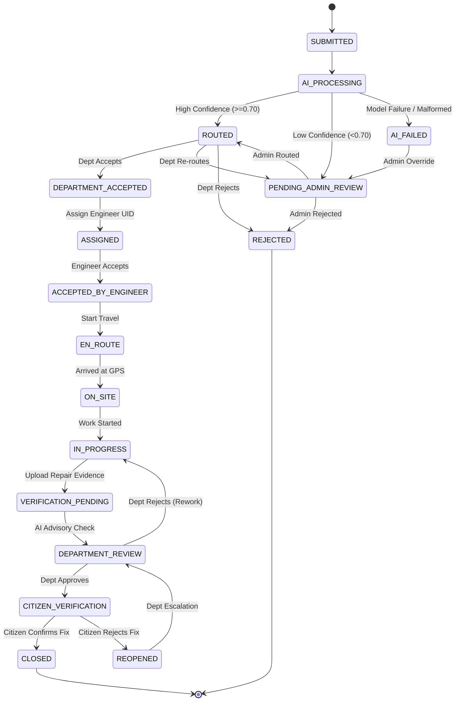

# CivicConnect Workflow State Machine

The CivicConnect complaint lifecycle is governed by an explicit 17-state finite state machine with strict role-based permission gates.

---

## 1. Complete Workflow States

| State | Role Responsible | Description |
|---|---|---|
| `SUBMITTED` | Citizen | Issue submitted with description, geolocation, and before photos. |
| `AI_PROCESSING` | AI Gateway | Complaint analyzed by AI for classification, priority, and duplicate risk. |
| `AI_FAILED` | Admin | AI service unavailable or returned invalid JSON; queued for admin triage. |
| `PENDING_ADMIN_REVIEW` | Admin | Confidence below threshold (<0.70) or flagged as potential duplicate. |
| `ROUTED` | Department | Confidently classified and routed to the target municipal department. |
| `DEPARTMENT_ACCEPTED` | Department | Department reviews and acknowledges custody of the complaint. |
| `ASSIGNED` | Department | Coordinator assigns the complaint to a specific engineer UID. |
| `ACCEPTED_BY_ENGINEER` | Engineer | Field engineer reviews assignment details and accepts the task. |
| `EN_ROUTE` | Engineer | Engineer has departed toward the complaint coordinates. |
| `ON_SITE` | Engineer | Engineer has arrived at the physical geolocation. |
| `IN_PROGRESS` | Engineer | Active maintenance, repair, or construction work is underway. |
| `VERIFICATION_PENDING` | System / AI | Engineer uploaded repair evidence (after photos + notes); awaiting check. |
| `DEPARTMENT_REVIEW` | Department | Coordinator inspects AI advisory evaluation and field repair evidence. |
| `CITIZEN_VERIFICATION` | Citizen | Department approved repair; citizen requested to inspect and rate. |
| `CLOSED` | Citizen / System | Citizen confirms satisfactory resolution; complaint archived. |
| `REOPENED` | Citizen | Citizen rejects resolution with rationale; sent back for department rework. |
| `REJECTED` | Department / Admin | Complaint rejected (out of jurisdiction, duplicate, or invalid). |

---

## 2. Permitted Transitions Matrix

---

## 3. Role Transition Guard Rules

- **Citizen**:
  - May create `SUBMITTED`.
  - May transition `CITIZEN_VERIFICATION` $\rightarrow$ `CLOSED` or `REOPENED`.
  - Cannot modify routing, department, engineer assignment, priority, or SLA.
- **Department**:
  - May accept/reject `ROUTED`.
  - May transition `DEPARTMENT_ACCEPTED` $\rightarrow$ `ASSIGNED` via engineer UID.
  - May transition `DEPARTMENT_REVIEW` $\rightarrow$ `CITIZEN_VERIFICATION` or back to `IN_PROGRESS`.
  - Restricted strictly to complaints where `routing.departmentId == user.departmentId`.
- **Engineer**:
  - May only step through: `ASSIGNED` $\rightarrow$ `ACCEPTED_BY_ENGINEER` $\rightarrow$ `EN_ROUTE` $\rightarrow$ `ON_SITE` $\rightarrow$ `IN_PROGRESS` $\rightarrow$ `VERIFICATION_PENDING`.
  - Must provide authentic `after` media URLs and work notes to reach `VERIFICATION_PENDING`.
  - Cannot skip stages or directly close complaints.
- **Admin**:
  - Unrestricted system oversight for exception queues (`AI_FAILED`, `PENDING_ADMIN_REVIEW`, `REOPENED`).
